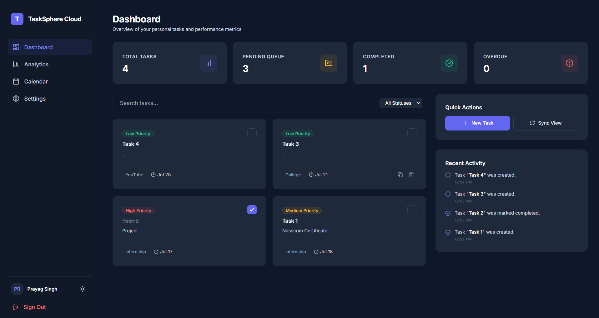
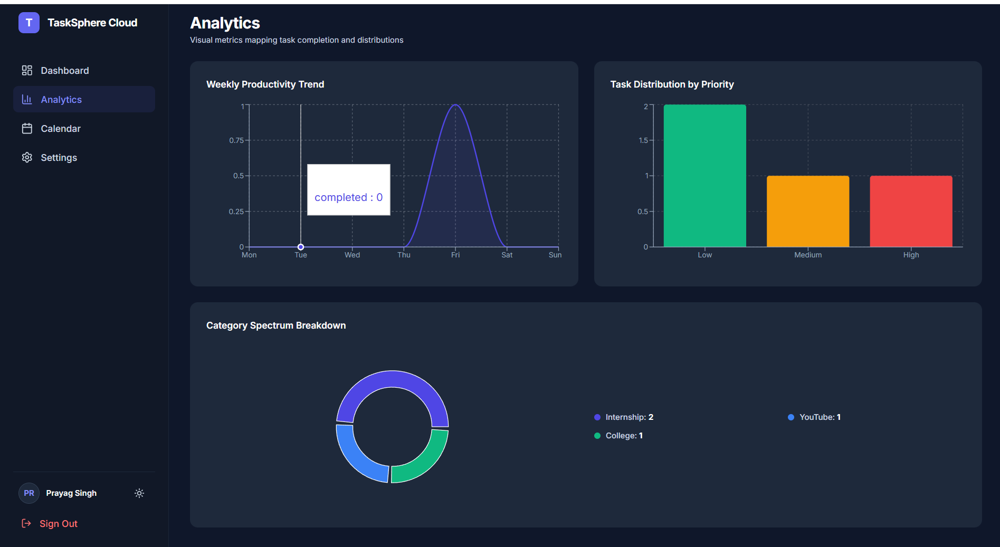
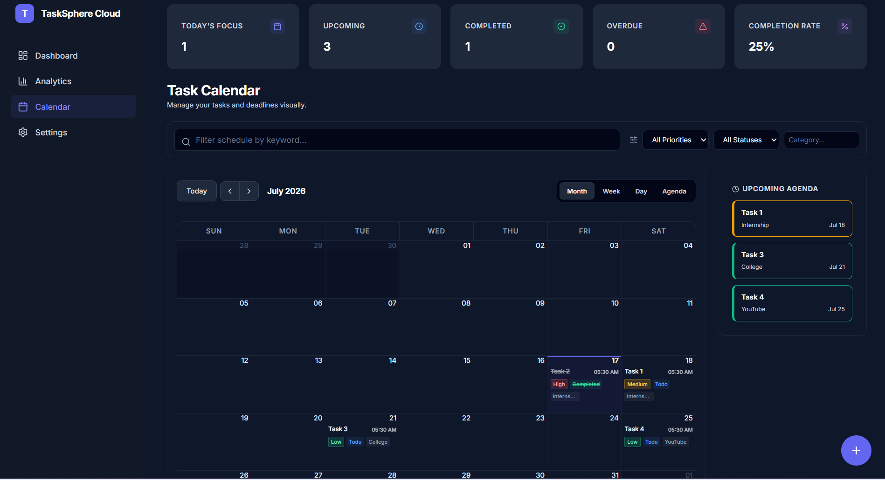
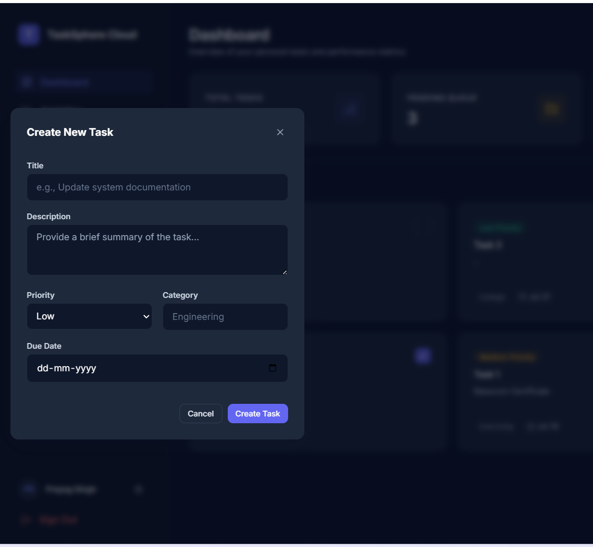
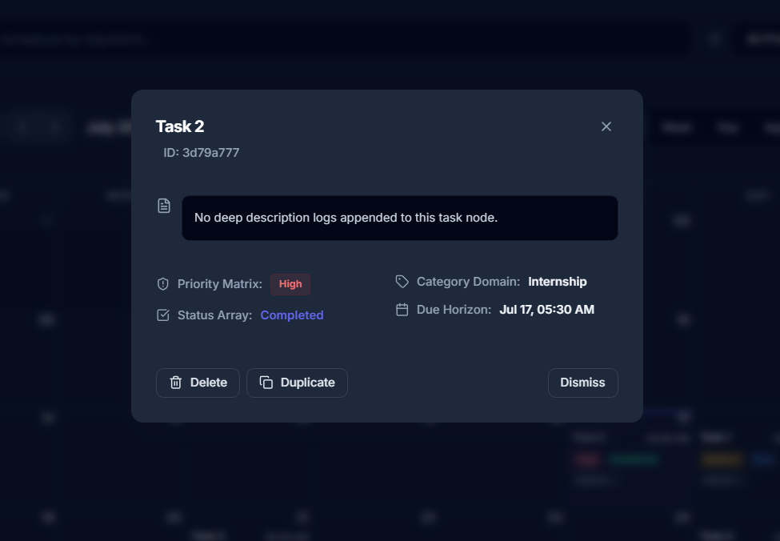
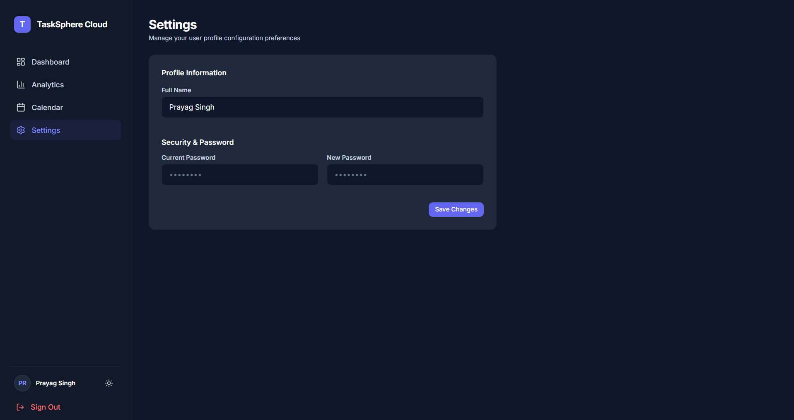

# ☁️ TaskSphere Cloud

A modern full-stack cloud-powered task management application built with **React**, **Node.js**, **Express.js**, and **IBM Cloudant NoSQL Database**.

TaskSphere Cloud helps users efficiently manage daily tasks through a clean dashboard, interactive calendar, real-time analytics, and secure authentication.

---

## ✨ Features

### 🔐 Authentication
- Secure JWT Authentication
- User Registration & Login
- Protected Routes
- Password Encryption

### 📋 Task Management
- Create, Update & Delete Tasks
- Duplicate Tasks
- Priority & Status Management
- Category Organization
- Search & Filters

### 📅 Calendar
- Month View
- Week View
- Day View
- Agenda View
- Event Details
- Upcoming Tasks Sidebar

### 📊 Analytics
- Task Statistics
- Weekly Productivity
- Completion Rate
- Priority Distribution
- Category Breakdown
- Overdue & Upcoming Tasks

### 🎨 Modern UI
- Responsive Layout
- Dark Theme
- Smooth Animations
- Interactive Dashboard
- Modern Cards
- Task Modals

### ☁️ Cloud Integration
- IBM Cloudant NoSQL Database
- REST API Architecture
- Persistent Cloud Storage

---

# 📸 Screenshots

## Dashboard



---

## Analytics Dashboard



---

## Task Calendar



---

## Create Task



---

## Task Details



---

## Settings



---

# 🛠️ Tech Stack

## Frontend

- React 19
- Vite
- Tailwind CSS
- React Router
- React Query
- Framer Motion
- React Big Calendar
- Recharts
- Axios
- Lucide React

## Backend

- Node.js
- Express.js
- JWT Authentication
- bcryptjs
- UUID
- IBM Cloudant SDK

## Database

- IBM Cloudant NoSQL Database

---

# 📂 Project Structure

```text
cloud-task-manager/
│
├── backend/
│   ├── config/
│   ├── controllers/
│   ├── middleware/
│   ├── routes/
│   ├── server.js
│   └── package.json
│
├── frontend/
│   ├── src/
│   ├── public/
│   └── package.json
│
├── screenshots/
│
├── docker-compose.yml
└── README.md
```

---

# 🚀 Installation

## Clone Repository

```bash
git clone https://github.com/PrayagSingh9A7/cloud-task-manager.git

cd cloud-task-manager
```

## Backend

```bash
cd backend

npm install

npm run dev
```

Runs on:

```
http://localhost:5000
```

---

## Frontend

```bash
cd frontend

npm install

npm run dev
```

Runs on:

```
http://localhost:5173
```

---

# ⚙️ Environment Variables

Create a `.env` file inside the **backend** folder.

```env
PORT=5000

JWT_SECRET=your_secret_key

CLOUDANT_URL=your_cloudant_url

CLOUDANT_APIKEY=your_cloudant_api_key

CLOUDANT_USERNAME=your_cloudant_username
```

---

# 🏗️ Architecture

```text
React Frontend
        │
        ▼
 Express REST API
        │
        ▼
IBM Cloudant NoSQL Database
```

---

# 🚀 Future Improvements

- Drag & Drop Calendar
- Team Collaboration
- Email Notifications
- AI Task Suggestions
- Kanban Board
- Mobile App
- Google Calendar Sync

---

# 🤝 Contributing

Contributions are welcome.

1. Fork the repository
2. Create a new feature branch
3. Commit your changes
4. Push your branch
5. Open a Pull Request

---

# 👨‍💻 Author

**Prayag Singh**

GitHub: https://github.com/PrayagSingh9A7

---

# 📄 License

This project is licensed under the MIT License.

---

⭐ If you found this project useful, consider giving it a **Star** on GitHub.